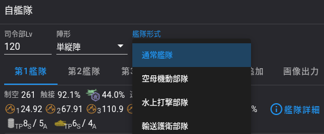
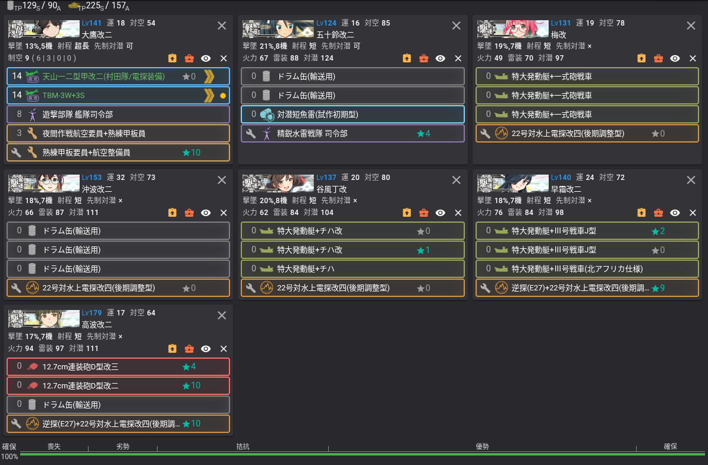

_Better to know a knot and not need it, than to need a knot and not know it._

---

### Combine fleet setting

When in event, you might need to setup combine fleet for kcauto_custom.  

Which can be done by selecting combine fleet in Noro6's config panel.  

For strike fleet, simply put 7 ships in fleet field,  
kcauto_custom will automatically set the fleet type to strike.  

