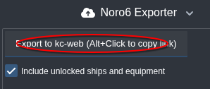
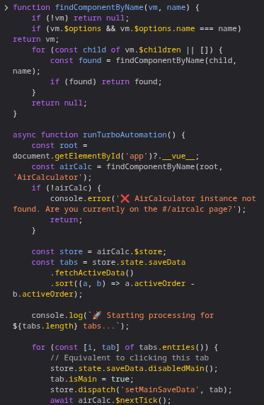
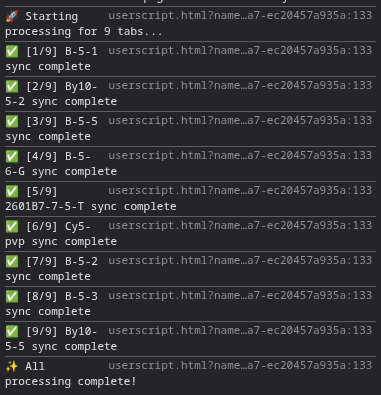
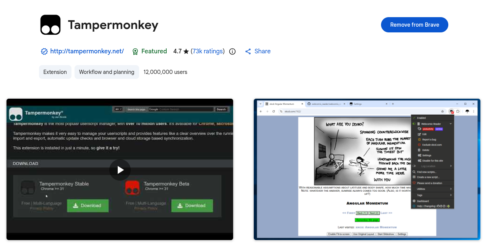
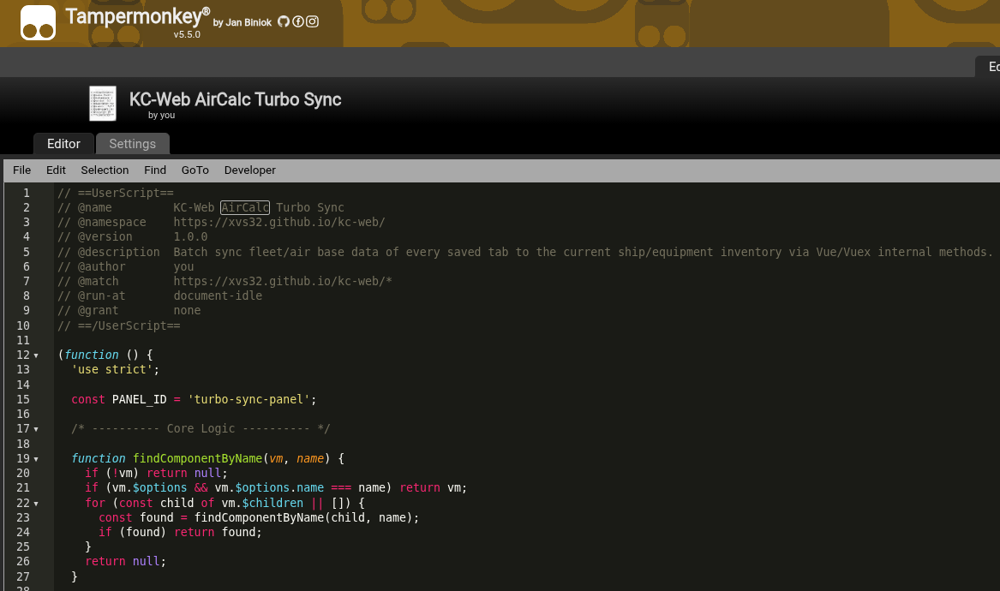
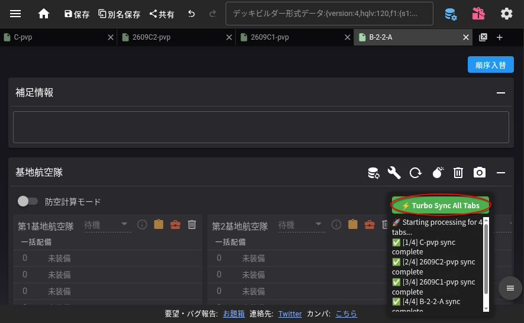

_巧遅は拙速に如かず。_

---

## 付録 ‐‐ Noro6 装備の更新

装備を改修しても Noro6 は自動で更新されないため、やがて以下の警告に溺れでしまいます：

この記事では、`kcauto_custom` ツールボックスにある半自動スクリプトの使用方法を説明します。これは Noro6 の装備データを手動で更新する手間を省くためのものです。

---

### 概要

このスクリプトの目的は、Noro6 の各コンフィグの更新ボタンを自動的にクリックし、現在所持している装備と同期させることです。

***Noro6 の装備更新機能***

---

### 準備

#### 装備データの更新
まず、POI から最新のデータを取得する必要があります。

***POI からのエクスポート***

#### アクセス制御
このスクリプトは、開いているタブのみを処理します。  
逆に言うと、装備を更新したくないコンフィグは閉じておけばよいのです。

***閉じられたコンフィグ B-2-2-A***

#### 自動保存

スクリプトが更新処理を完了した後、各ファイルが保存されるように **設定パネルで自動保存をオン** にすることをお勧めします。

***Noro6 の自動保存オプション***

#### 更新ポリシー (オプション)

装備の置換ポリシーで `Keep` オプションを選択すると、装備が不足している場合に `kcauto_custom` が判別しやすくなります。

    

***無効な装備を空のスロットにするのではなく選択したままにする***

---

### スクリプトの実行（ブラウザのコンソール）

F12 キーを押して開発者ツールを開き、`コンソール (Console)` パネルに移動します。

***ブラウザのコンソールパネル***

スクリプトは [tool/noro6_equipment_update.js](https://github.com/XVs32/kcauto_custom/blob/develop/tool/noro6_equipment_update.js) にあります。  
コードをコピーしてコンソールパネルに貼り付け、`Enter` キーを押して実行してください。

***実行準備が完了したスクリプト***

***装備の自動更新***

---

### スクリプトの実行 (Tampermonkey)

あるいは、毎回開発者ツールを開く必要のない、便利なワンクリック実行用の Tampermonkey スクリプトをインストールすることもできます。

ブラウザに [Tampermonkey](https://chromewebstore.google.com/detail/tampermonkey/dhdgffkkebhmkfjojejmpbldmpobfkfo) 拡張機能をインストールします。

Tampermonkey ダッシュボードを開き、「新規スクリプトを作成」をクリックします。  
次に、Noro6 Turbo Sync ユーザースクリプトの [コード](https://github.com/XVs32/kcauto_custom/blob/develop/tool/noro6_equipment_update_tampermonkey.js) を貼り付けます。

_スクリプトを保存 (Ctrl+S) し、有効になっていることを確認してください。_

Noro6 (XVs32's edition) のページに移動します: [https://xvs32.github.io/kc-web/#/aircalc](https://xvs32.github.io/kc-web/#/aircalc)

右下にフローティングパネルが自動的に表示されます。  
「⚡ Turbo Sync All Tabs」をクリックして一括更新を開始します。

_Tampermonkey スクリプトによって挿入されたフローティングパネル_

---

完了です！  
これでコンフィグを `kcauto_custom` のフォルダにエクスポートしましょう。
