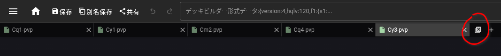

_Self-help is the best help._

---

## Appendix ‐‐ Noro6 XVs32's edition

To be flankly honest, 
I wasn't going to setup this tool...  
Tho it takes forever for Noro6 to review my [Pull Request](https://github.com/noro6/kc-web/pull/18) so...

Anyway, just to let you guys know this is NOT the original Noro6.  

There are 2 additions I added to the original tool:

---

### Close all tabs

There is now a button `Close All` on the top-right corner of the tool,
which closes all tabs, simple. 

### Reverse look up

Under `Ship / Equipment` panel,  
there is now reverse lookup function,  
you can check which config uses this ship/equipment. 

Extreamly useful when tidying up for expedition ship pool.

