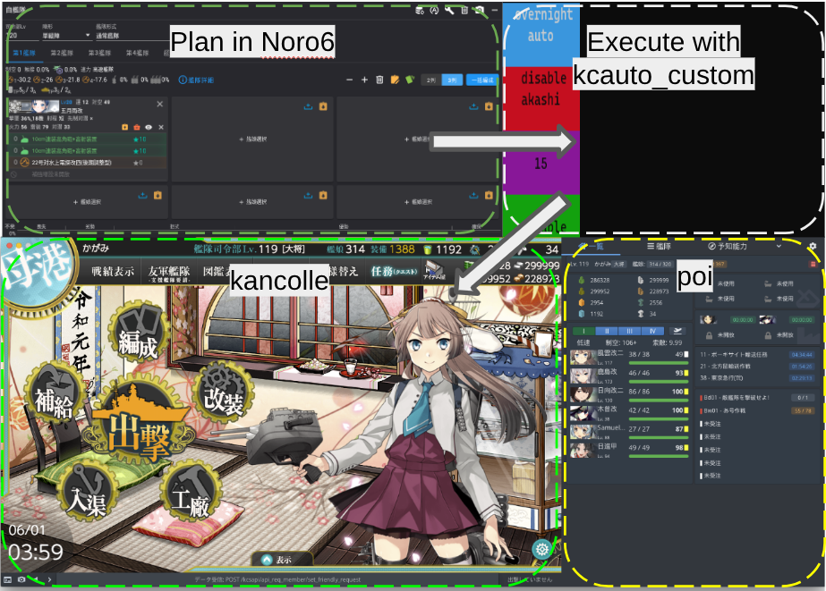

# kcauto_custom

### ***最新下載 (2026/07/27)*** [***請點此***](https://github.com/XVs32/kcauto_custom/releases/tag/v3.2.0) 

***警告***：雖然 `kcauto_custom` 理論上可以在 Windows 上執行，但它昰在 Linux 上設計的。對於相容性問題，作者不保證會修復。

**[kcauto_custom](https://github.com/XVs32/kcauto_custom)** 是一個停更專案 [kcauto](https://github.com/perryhuynh/kcauto) 的調整版本，加入了額外的功能與特性。  
與 **kcauto** 相比，**kcauto_custom** 設定彈性較低，但日常使用更自動化。  
面向不想自行建置 Python 環境的使用者，我們也提供執行檔 (.exe)。  
使用者可以在 [Noro6](https://noro6.github.io/kc-web/#/aircalc) 中配置艦隊與裝備，然後透過 `kcauto_custom` 執行計畫。  
本工具旨在協助使用者自動化重複性的任務，例如遠征、出擊、演習、維修與補給，進而節省時間並提高效率。

---

> ### 免責聲明

> `kcauto_custom` 僅供教育用途。使用機器人程式違反遊戲規則，長期使用可能會導致帳號被封禁。`kcauto_custom` 開發者對於使用此工具所導致的任何後果概不負責。後果自負！

> 雖然機率極低，但使用 `kcauto_custom` 進行戰鬥出擊時，仍可能導致艦娘沉沒或裝備遺失。儘管 `kcauto_custom` 在設計上已極力降低此類風險，但開發者對任何艦娘或資源的損失概不負責。

### kcauto 原生功能

* 遠征 (Expedition) &mdash; 自動化遠征
* 演習 (PvP) &mdash; 自動化演習
* 出擊 (Combat) &mdash; 自動化出擊
* 基地航空隊 (LBAS) &mdash; 自動化基地航空隊管理
* 艦娘切換 (Ship Switcher) &mdash; 於出擊間根據指定條件自動切換艦娘
* 艦隊切換 (Fleet Switcher) &mdash; 自動切換演習與出擊的艦隊預設
* 任務 (Quests) &mdash; 自動化任務管理
* 修理與補給 (Repair & Resupply) &mdash; 自動化艦隊維修與補給
* 統計 (Stats) &mdash; 記錄各項自動化動作的數據
* 點擊追蹤 (Click Tracking) &mdash; 選擇性記錄 `kcauto` 執行過的點擊操作
* 排程與手動暫停 &mdash; 支援單一模組或整體指令碼的排程、手動暫停
* 貓點重連與腳本自動恢復
* 導航、計時與點擊位置的隨機偏移（對抗反機器人偵測）

### kcauto_custom 新增功能

* 提供執行檔 &mdash; 不再需要為建立 Python 環境而苦惱
* CUI (Character User Interface) &mdash; 方便日常使用
* 明石維修模組 &mdash; 使用明石進行艦隊維修
* 工廠模組 &mdash; 自動化執行每日開發與艦娘建造
* Noro6 支援 &mdash; 在 Noro6 中規劃你的艦隊與裝備，由 `kcauto_custom` 自動執行
* 裝備切換模組 &mdash; 自動為演習、出擊與遠征切換裝備預設
* 自動出擊模式 (Sortie mode: Auto) &mdash; 自動完成日/週/月常任務
* 自動遠征模式 (Expedition mode: Auto) &mdash; 自動資源平衡與自動切換遠征艦隊
* 支援 7-4 與活動海域
* 各類 Bug 修復 (艦隊切換模組、interaction_mode、任務處理、LBAS 模組等)

## Wiki 頁面

### [POI 版本](https://xvs32.github.io/kcauto_custom/)

### [Brave (KC3) 版本](https://github.com/XVs32/kcauto_custom/wiki)

---
*以下連結需要 GitHub 帳號*

### [許願池 (Wishing pool)](https://github.com/XVs32/kcauto_custom/discussions/categories/ideas)：新功能建議與許願
### [錯誤回報 (Bug report)](https://github.com/XVs32/kcauto_custom/issues)：兄弟，初四了
### [問答 (Q&A)](https://github.com/XVs32/kcauto_custom/discussions/categories/q-a)：有問題想問嗎？
